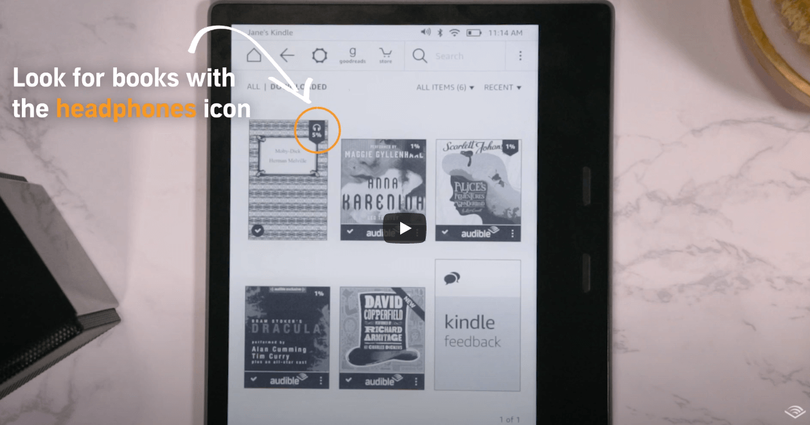
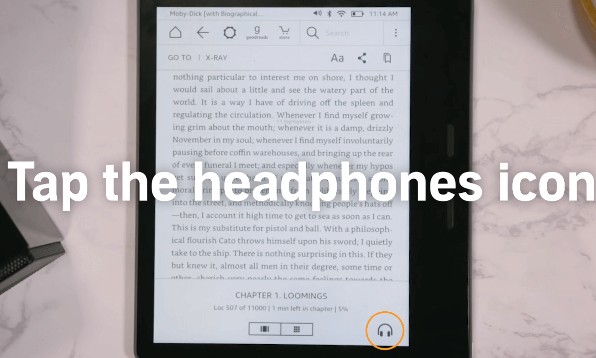
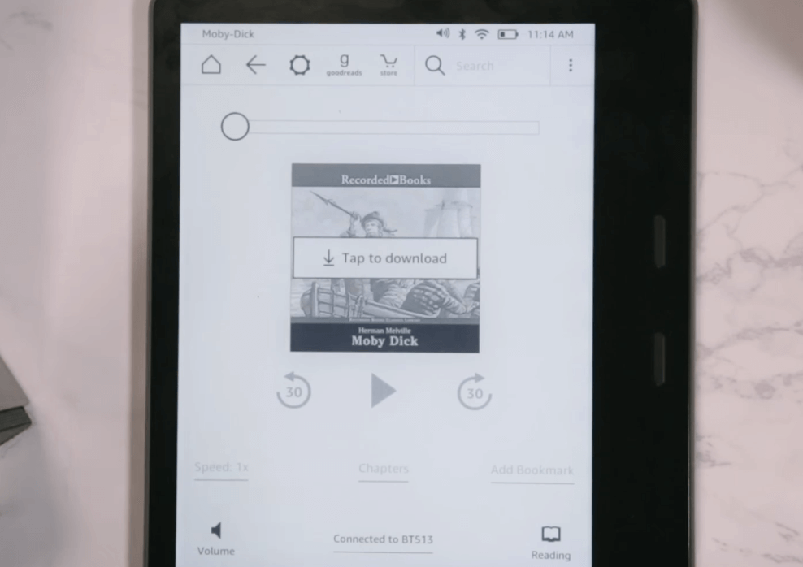
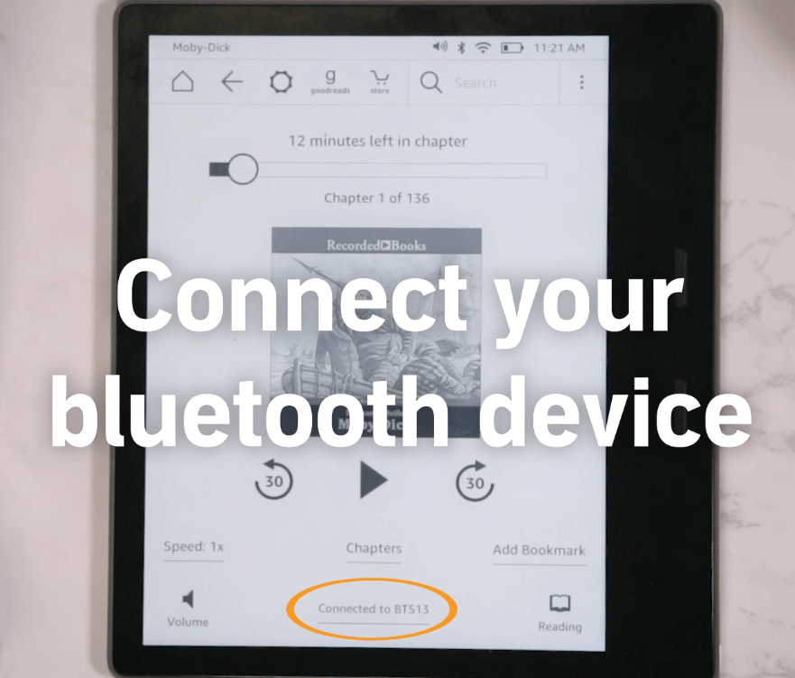

Hvis du er indehaveren af en <a href="https://bedsteeboglaeser.dk/bedste-eboglæser" target="_blank">Amazon paper white</a> eller <a href="https://bedsteeboglaeser.dk/bedste-eboglæser" target="_blank">Amazon oasis</a> e boglæser har du heldet med dig. Du har nemlig muligheden for at lytte til lydbog på din eboglæser. I denne guide vil vi vise dig hvordan du kan få sat det op i fire lette trin.

## 1. Se efter bøger som har et headset icon

Se efter om en bestemt e bog har et headset icon som indikerer at du kan lytte til den. Det er nemlig ikke alle e bøger som giver mulighed for det.

## 2. Klik på headset iconet

Når du har fundet en ebog som giver mulighed for at lytte til den som en lydbog skal du klikke på ikonet som vil viderefører dig til en side hvor du kan downloade e bogen.

## 3. Klik for at downloade lydbog

Tryk på download knappen.

## 4. Tilslut trådløs bluetooth

Du skal tilslutte med bluetooth for at lytte til lydbogen. Det kan være enten et trådløst headset eller air pods.

## 5. Tilmeld dig Audible og få en masse fordele

for at kunne lytte til lydbøger på din e boglæser skal du først tilmelde dig Audible som er en lydbogstjeneste hvor du kan lytte til tusindvis af lydbøger.

Her er fire grunde til at prøve audible:

- Behold dine e bøger selv hvis du opsiger audible
- Op til 80% rabat på bestemte lydbøger
- Få en gratis lydbog hver måned

<a href="https://www.amazon.co.uk/hz/audible/mlp?_encoding=UTF8&tag=serier-20" target="_blank"  style="background-color:#f44336; 
	border-radius:28px;
	border:1px solid #f44336;
	display:inline-block;
	cursor:pointer;
	color:#ffffff;
	font-family:Arial;
	font-size:17px;
	padding:16px 31px;
	text-decoration:none;
	text-shadow:0px 1px 0px #2f6627;" >Prøv audible gratis i 30 dage</a>  
	*Annoncelink

